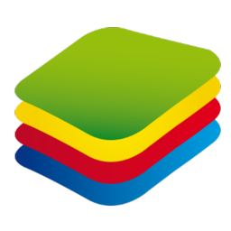
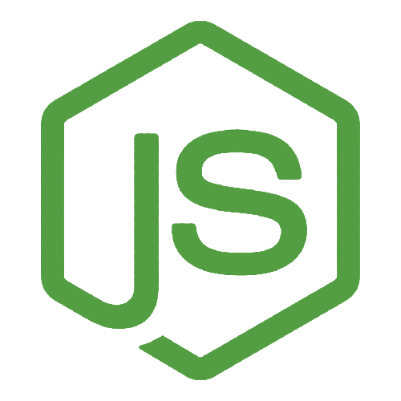

# `Curriculum Vitae`
 

:green_circle: PTBR

## `Olá mundo`, sou o Eduardo Talarico (dudushy) :smile:
> Brasileiro, 22 anos :birthday:

### :trophy: Objetivos:

- Crescer profissionalmente
- Solucionar problemas
- Contribuir para a sociedade
- Adquirir conhecimento
- Trabalhar em equipe
- Desenvolver e criar

### :sparkling_heart: Paixões:

- Aprender
- Programar
- Ajudar
- Criar
- Jogar
- Ouvir música

### :star2: Qualidades:

- Determinado
- Prático
- Calmo
- Proativo
- Honesto
- Prudente
- Compreensivo
- Detalhista
- Persistente
- Empático
- Criativo
- Lógico

---
### :globe_with_meridians: Conexões:

[][linkedin]
[][discord]
[][steam]
[][spotify]
 
 

---
### :brain: Linguagens de programação conhecidas:

-  Python

-  Java

-  JavaScript

-  SQL

-  HTML

-  CSS

-  C#

-  PHP
    
-  TypeScript
    
-  SASS
 

### :hammer_and_wrench: Ferramentas conhecidas:

-  [Visual Studio Code][vscode]

-  [pgAdmin][pgadmin]

-  [NetBeans][netbeans]

-  [Sublime Text][sublimetext]

-  [Notepad++][notepadplusplus]

-  [Visual Studio][vs]

-  [Postman][postman]
    
-  [SSMS][ssms]
    
-  [GitHub Desktop][githubdesktop]

-  [XAMPP][xampp]
    
-  [BlueStacks][bluestacks]

-  [Insomnia][insomnia]

-  [Android Studio][androidstudio]

-  [FileZilla][filezilla]

-  [Ionic][ionic]

-  [NodeJS][nodejs]
    
-  [AWS][aws]
    
-  [Angular][angular]
    
-  [Firebase][firebase]
 

---
## :mortar_board: Formação:

- Ensino médio completo no **Colégio Ideal** *(2018)* :heavy_check_mark:
- Ensino superior completo em **Ciência da Computação** na **UNIP (Universidade Paulista)** *(2019 - 2022)* :heavy_check_mark:

---
## :bookmark_tabs: Experiência:

- Estagiário **SPEDO TECNOLOGIA LTDA** (*05/2022 - 12/2022*) :heavy_check_mark:
    > 1. Desenvolvimento de Aplicação Web (PHP, JavaScript, Angular)
    > 2. Desenvolvimento de Aplicações Mobile (Ionic, Angular, NodeJS)
    > 3. Estruturação e manutenção em Banco de Dados (MySQL, phpMyAdmin, SQLite)
    > 4. Integração de plugins, páginas, componentes, mídias e serviços
    > 5. Consumo de Web Services e APIs
    > 6. Criação de layouts, paletas de cores
    > 7. Desenvolvimento e manutenção de múltiplos apps
    > 8. Correção de bugs
    > 9. Interfaces dinâmicas e responsivas
    > 10. Manipulação de arquivos
    > 11. Formatação de texto, imagem, data e dados
    > 12. Sincronização de dados em nuvem
    > 13. Utilização de Emuladores para testar e desenvolver apps

- Analista de Sistemas **SPEDO TECNOLOGIA LTDA** (*02/2023*) :diamond_shape_with_a_dot_inside:
    > 1. Estruturação e desenvolvimento de Aplicações Mobile (Ionic, Angular, NodeJS)
    > 2. Criação e consumo de Banco de Dados (SQLite)
    > 3. Consumo de Web Services e APIs

---
## :heavy_plus_sign: Informações adicionais:

- Conhecimento avançado de Inglês

- Criação de projetos simples em Java (CRUD)

- Elaboração de trabalhos extracurriculares, fazendo algoritmos e BOTs com intuito de automatizar certas tarefas do dia-a-dia (bot de mensagens, criptografia, matemática, formatação de texto)

- Tenho contato com jogos e computadores (de todos os tipos e categorias, online e offline) desde pequeno, sempre admirei cada detalhe existente nos jogos (funcionamento, gráficos, mecânicas e desenvolvimento)

- Projetos Open Source no GitHub

- Freelances de Websites

(<a href="#curriculum-vitae">voltar ao topo</a>)

---

:large_blue_circle: ENG

## `Hello World`, I'm Eduardo Talarico (dudushy) :smile:
> Brazilian, 22 years old :birthday:

### :trophy: Goals:

- Grow professionally
- Solve problems
- Contribute to society
- Acquire knowledge
- Team work
- Develop and create

### :sparkling_heart: Passions:

- Learn
- Code
- Help
- Create
- Play
- Listen to music

### :star2: Qualities:

- Determined
- Practical
- Calm
- Proactive
- Honest
- Prudent
- Comprehensive
- Detail-oriented
- Persistent
- Empathic
- Creative
- Logical

---
### :globe_with_meridians: Connections:

[][linkedin]
[][discord]
[][steam]
[][spotify]
 
 

---
### :brain: Known programming languages:

-  Python

-  Java

-  JavaScript

-  SQL

-  HTML

-  CSS

-  C#

-  PHP
    
-  TypeScript
    
-  SASS
 

### :hammer_and_wrench: Known tools:

-  [Visual Studio Code][vscode]

-  [pgAdmin][pgadmin]

-  [NetBeans][netbeans]

-  [Sublime Text][sublimetext]

-  [Notepad++][notepadplusplus]

-  [Visual Studio][vs]
    
-  [Postman][postman]
    
-  [SSMS][ssms]
    
-  [GitHub Desktop][githubdesktop]

-  [XAMPP][xampp]
    
-  [BlueStacks][bluestacks]

-  [Insomnia][insomnia]

-  [Android Studio][androidstudio]
   
-  [FileZilla][filezilla]

-  [Ionic][ionic]

-  [NodeJS][nodejs]
    
-  [AWS][aws]
    
-  [Angular][angular]
    
-  [Firebase][firebase]
 

---
## :mortar_board: Formation:

- Complete high school at **Colégio Ideal** *(2018)* :heavy_check_mark:
- Complete university in **Computer Science** at **UNIP (Universidade Paulista)** *(2019 - 2022)* :heavy_check_mark:

---
## :bookmark_tabs: Experience:

- Trainee **SPEDO TECNOLOGIA LTDA** (*05/2022 - 12/2022*) :heavy_check_mark:
    > 1. Web Application Development (PHP, JavaScript, Angular)
    > 2. Mobile Applications Development (Ionic, Angular, NodeJS)
    > 3. Database structuring and maintenance (MySQL, phpMyAdmin, SQLite)
    > 4. Integration of plugins, pages, components, media and services
    > 5. Use of Web Services and APIs
    > 6. Creation of layouts, color palettes
    > 7. Development and maintenance of multiple apps
    > 8. Bug fixes
    > 9. Dynamic and responsive interfaces
    > 10. File manipulation
    > 11. Text, image, date and data formatting
    > 12. Cloud data sync
    > 13. Using of Emulators to test and develop apps

- Systems Analyst **SPEDO TECNOLOGIA LTDA** (*02/2023*) :diamond_shape_with_a_dot_inside:
    > 1. Structuring and development of Mobile Applications (Ionic, Angular, NodeJS)
    > 2. Database creation and use (SQLite)
    > 3. Use of Web Services and APIs

---
## :heavy_plus_sign: Additional information:

- Advanced English knowledge

- Creation of simple Java projects (CRUD)

- Elaboration of extracurricular projects, making algorithms and BOTs with the aim of automating certain daily tasks (message bot, cryptography, math, text formatting)

- I've been in contact with games and computers (of all kinds and categories, online and offline) since I was little, I've always admired every detail in the games (functioning, graphics, mechanics and development)

- Open Source Projects on GitHub

- Websites Freelances 

(<a href="#curriculum-vitae">back to top</a>)

---
## :bar_chart: My Stats:

    <a href="https://github.com/dudushy">
        <table style="table-layout: auto;">
            <tr>
                <td>
                    
                </td>
                <td>
                    
                </td>
            </tr>
            <tr>
                <td>
                    
                </td>
                <td>
                    
                </td>
            </tr>
        </table>
    </a>

[linkedin]: https://www.linkedin.com/in/eduardo-talarico/
[discord]: https://discord.gg/jG9BtQE
[steam]: https://steamcommunity.com/id/dudushy/
[spotify]: https://open.spotify.com/user/u8cq59bsrp4cdmp2haxrxu9pi
[vscode]: https://code.visualstudio.com/
[pgadmin]: https://www.pgadmin.org/
[netbeans]: https://netbeans.apache.org/
[sublimetext]: https://www.sublimetext.com/
[notepadplusplus]: https://notepad-plus-plus.org/
[vs]: https://visualstudio.microsoft.com/vs/
[postman]: https://www.postman.com/
[ssms]: https://docs.microsoft.com/pt-br/sql/ssms/download-sql-server-management-studio-ssms?view=sql-server-ver15
[githubdesktop]: https://desktop.github.com/
[xampp]: https://www.apachefriends.org/pt_br/index.html
[bluestacks]: https://www.bluestacks.com/
[insomnia]: https://insomnia.rest/
[androidstudio]: https://developer.android.com/studio
[filezilla]: https://filezilla-project.org/
[ionic]: https://ionic.io/
[nodejs]: https://nodejs.org/
[aws]: https://aws.amazon.com/
[angular]: https://angular.io/
[firebase]: https://firebase.google.com/
